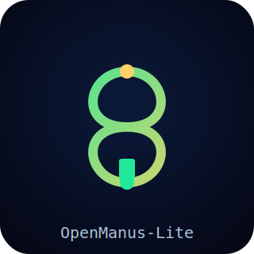
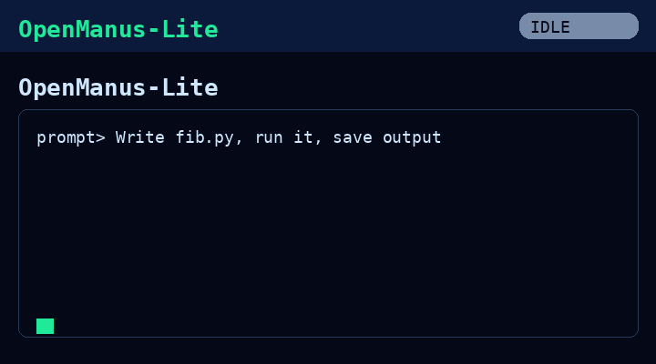

# OpenManus-Lite

<p align="center">
  
</p>

<p align="center">
  A lightweight, open-source
  general-purpose AI agent framework
  with a think&ndash;act tool-calling loop.
</p>

<p align="center">
  
</p>

<p align="center">
  <a href="LICENSE"></a>
  <a href="LICENSES/LICENSE.apache-2.0"></a>
  <a href="LICENSES/LICENSE.bsd-3-clause"></a>
  <a href="LICENSES/LICENSE.gpl-3.0"></a>
  
  
  <a href="https://github.com/Celebez/OpenManus-Lite"></a>
</p>

---

## Open Source Status

**Yes — OpenManus-Lite is fully open source.** The complete source code is
public on GitHub under the **MIT License** (see [LICENSE](LICENSE)). MIT is an
OSI-approved open-source license: anyone may use, copy, modify, merge, publish,
distribute, sublicense, and/or sell the software freely, as long as the
copyright notice and license text are retained.

What "open source" means here, concretely:

- ✅ Source code is public and readable end-to-end (~1,000 lines).
- ✅ You can fork, modify, and redistribute it.
- ✅ No license fee, no invite code, no paywall.
- ✅ Contributions are welcome (see [CONTRIBUTING](CONTRIBUTING.md)).

### Project health files

| File | Purpose |
|------|---------|
| [LICENSE](LICENSE) | MIT license text (full, OSI-approved) |
| [CONTRIBUTING.md](CONTRIBUTING.md) | How to contribute |
| [CODE_OF_CONDUCT.md](CODE_OF_CONDUCT.md) | Community standards (Contributor Covenant) |
| [README.md](README.md) | Full documentation |

### Available licenses

OpenManus-Lite is distributed under the **MIT License** by default. If your
project requires different terms, the following alternative licenses are also
provided in the [`LICENSES/`](LICENSES) directory — pick the one that fits your
use case:

| License | File | Type | Highlights |
|---------|------|------|-----------|
| MIT | [LICENSE](LICENSE) | Permissive | Short, maximum freedom, no patent clause. **Default.** |
| Apache-2.0 | [LICENSES/LICENSE.apache-2.0](LICENSES/LICENSE.apache-2.0) | Permissive | Adds explicit patent grant + attribution notices. |
| BSD-3-Clause | [LICENSES/LICENSE.bsd-3-clause](LICENSES/LICENSE.bsd-3-clause) | Permissive | Like MIT, bars use of contributor names for endorsement. |
| GPL-3.0 | [LICENSES/LICENSE.gpl-3.0](LICENSES/LICENSE.gpl-3.0) | Copyleft | Strong copyleft; derivative works must stay GPL-3.0. |

> Note: These are provided as options. Unless you explicitly state otherwise,
> the project itself is released under **MIT**. Choose one license and replace
> the root `LICENSE` file if you redistribute under different terms.

---

## Table of Contents

- [What is OpenManus-Lite?](#what-is-openmanus-lite)
- [Why this project exists](#why-this-project-exists)
- [Architecture](#architecture)
  - [Execution loop](#execution-loop)
  - [Directory layout](#directory-layout)
- [Modules in detail](#modules-in-detail)
  - [BaseAgent](#1-baseagent-appagentbasepy)
  - [ReActAgent](#2-reactagent-appagentreactpy)
  - [ToolCallAgent](#3-toolcallagent-appagenttoolcallpy)
  - [Manus](#4-manus-appagentmanuspy)
  - [LLM wrapper](#5-llm-wrapper-appllmpy)
  - [Schema](#6-schema-appschemapy)
  - [Tool system](#7-tool-system-apptool)
  - [Config](#8-config-appconfigpy)
- [Bundled tools](#bundled-tools)
- [How a task is solved (end-to-end)](#how-a-task-is-solved-end-to-end)
- [Installation](#installation)
- [Configuration](#configuration)
- [Usage](#usage)
- [Adding your own tool](#adding-your-own-tool)
- [Comparison with OpenManus](#comparison-with-openmanus)
- [Limitations](#limitations)
- [Roadmap](#roadmap)
- [License](#license)

---

## What is OpenManus-Lite?

OpenManus-Lite is a **compact, readable general-purpose AI agent framework**.
It implements the core idea of an agent that loops *think → act*
until a task is finished, in roughly 1,000 lines of clean Python — inspired by
the architecture of [OpenManus](https://github.com/FoundationAgents/OpenManus)
but built as a standalone, self-contained project.

It is meant as a **learning scaffold**: if you want to understand how an
agentic "do anything" loop actually works under the hood, this repository is
small enough to read end to end in one sitting.

---

## Why this project exists

The original OpenManus is powerful but large: browser automation, MCP servers,
multi-agent flows, Docker/Daytona sandboxes, token accounting, and more. That
surface area makes it hard to see the *essential* mechanism.

OpenManus-Lite strips the framework down to its skeleton:

1. A **stateful agent** that holds a conversation in memory.
2. A **loop** that repeatedly asks an LLM which tool to call next.
3. A small set of **tools** (code, shell, files) that the agent can use.
4. A **termination** signal that ends the run.

Everything else is an extension of those four ideas.

---

## Architecture

```
                main.py
                   │
                   ▼
                 Manus
                   │  (a ToolCallAgent)
                   ▼
        ┌──────────────────────┐
        │   ReActAgent.step()  │  loop: think() ──► act()
        └──────────────────────┘
                   │
        ┌──────────┴───────────┐
        ▼                      ▼
  ToolCallAgent.think()   ToolCallAgent.act()
        │                      │
        ▼                      ▼
   LLM.ask_tool()        ToolCollection.execute()
   (LLM + tool schema)        │
                              ▼
                   ┌─────────────────────┐
                   │  Tool (e.g. Bash)   │
                   └─────────────────────┘
                              │
                              ▼
                   observation ──► memory ──► next think()
```

### Execution loop

The heart of the framework is `BaseAgent.run()`:

```python
while self.current_step < self.max_steps and self.state != FINISHED:
    self.current_step += 1
    step_result = await self.step()      # think + act
    if self.is_stuck():
        self.handle_stuck_state()
```

`step()` is implemented by `ReActAgent` as `think()` followed by `act()`:

- **think()** — serialize memory into messages, call the LLM *with the tool
  schemas*, and store the model's chosen tool calls (or text) back into memory.
- **act()** — execute each chosen tool, attach the observation as a `tool`
  message, and let the next `think()` see the result.

The loop ends when:

- the model calls the `terminate` tool, OR
- `max_steps` is reached, OR
- an unrecoverable error sets the state to `FINISHED`/`ERROR`.

### Directory layout

```
OpenManus-Lite/
├── main.py                  # entry point (async)
├── requirements.txt
├── README.md
├── LICENSE
├── config/
│   └── config.example.toml  # copy to config.toml and fill in
├── assets/
│   ├── logo.svg
│   └── demo.gif
├── scripts/
│   └── make_demo_gif.py     # generates assets/demo.gif
├── workspace/               # default working directory for tools
└── app/
    ├── __init__.py
    ├── config.py            # TOML config loader (singleton)
    ├── llm.py               # OpenAI-compatible async LLM wrapper
    ├── logger.py
    ├── exceptions.py        # ToolError, TokenLimitExceeded
    ├── schema.py            # Message, Memory, ToolCall, AgentState
    ├── prompt/
    │   ├── manus.py         # system + next-step prompts for Manus
    │   └── toolcall.py      # generic toolcall prompts
    ├── agent/
    │   ├── base.py          # BaseAgent (loop, memory, state)
    │   ├── react.py         # ReActAgent (step = think+act)
    │   ├── toolcall.py      # ToolCallAgent (LLM tool calling)
    │   └── manus.py         # Manus (default general agent)
    └── tool/
        ├── __init__.py
        ├── base.py          # BaseTool, ToolResult
        ├── tool_collection.py
        ├── python_execute.py
        ├── bash.py
        ├── str_replace_editor.py
        ├── ask_human.py
        ├── create_chat_completion.py
        └── terminate.py
```

---

## Modules in detail

### 1. BaseAgent (`app/agent/base.py`)

The abstract foundation. Responsibilities:

- Holds `system_prompt`, `memory`, `state`, `max_steps`.
- Implements the `run()` loop with `state_context` (a context manager that
  safely transitions `IDLE → RUNNING → (FINISHED|IDLE|ERROR)`).
- Provides `update_memory(role, content)` to append `user`/`system`/
  `assistant`/`tool` messages.
- Detects loops via `is_stuck()` (counts identical consecutive assistant
  messages) and recovers with `handle_stuck_state()`.

Subclasses must implement `async def step() -> str`.

### 2. ReActAgent (`app/agent/react.py`)

A one-method subclass:

```python
async def step(self) -> str:
    should_continue = await self.think()
    if not should_continue:
        return "Thinking complete - no further action"
    return await self.act()
```

This is the ReAct pattern: **Re**ason (think) then **Act**.

### 3. ToolCallAgent (`app/agent/toolcall.py`)

Adds LLM-driven tool calling on top of ReAct:

- `think()` calls `LLM.ask_tool(messages, tools, tool_choice)`. It builds an
  assistant message (possibly with `tool_calls`) and stores it in memory.
- `act()` walks the tool calls, executes each via `ToolCollection.execute`,
  and appends a `tool` message with the observation.
- `_handle_special_tool()` inspects `special_tool_names` (default: `terminate`)
  and flips `state` to `FINISHED` when one is used.
- `cleanup()` gives every tool a chance to release resources.

`tool_choice` follows OpenAI semantics: `auto`, `none`, or `required`.

### 4. Manus (`app/agent/manus.py`)

The concrete default agent. It wires the prompt, raises `max_steps` to 20, and
assembles the default tool collection:

```python
available_tools = ToolCollection(
    PythonExecute(),
    Bash(),
    StrReplaceEditor(),
    AskHuman(),
    Terminate(),
)
```

To build a different agent, subclass `ToolCallAgent` (or `Manus`) and override
`available_tools` / `system_prompt`.

### 5. LLM wrapper (`app/llm.py`)

A thin async client around `openai.AsyncOpenAI` (works with any
OpenAI-compatible endpoint — OpenAI, Azure, local vLLM, etc.).

- `ask(messages, system_msgs, stream)` → plain text completion.
- `ask_tool(messages, tools, tool_choice)` → returns an object with
  `.content` and `.tool_calls` (parsed into `ToolCall` objects).

Point it at your provider by editing `config.toml`.

### 6. Schema (`app/schema.py`)

Pydantic models shared across the framework:

- `Role` — system / user / assistant / tool.
- `Message` — a single chat message with optional `tool_calls`, `base64_image`.
- `ToolCall` / `Function` — a parsed function call.
- `Memory` — an append-only list of `Message` objects (capped at
  `max_messages`).
- `AgentState` — IDLE / RUNNING / FINISHED / ERROR.
- `ToolChoice` — none / auto / required.

### 7. Tool system (`app/tool`)

Two building blocks:

- `BaseTool` (abstract): defines `name`, `description`, `parameters`
  (a JSON-schema dict), and `async def execute(**kwargs)`. `to_param()` turns
  it into the OpenAI `function` tool format. `success_response` / `fail_response`
  wrap results in a `ToolResult`.
- `ToolCollection`: holds several `BaseTool`s, exposes `to_params()` (for the
  LLM) and `execute(name, tool_input)` (to run one).

### 8. Config (`app/config.py`)

Loads `config/config.toml` (or the `.example` fallback) into a singleton
`Config`. Supports a `[llm]` block (with per-agent overrides) and an optional
`[sandbox]` block. Exposes `config.llm`, `config.workspace_root`, etc.

---

## Bundled tools

| Tool | Purpose |
|------|---------|
| `python_execute` | Run Python code in-process; returns stdout. |
| `bash` | Run a shell command; returns stdout/stderr + exit code. |
| `str_replace_editor` | `view` / `create` / `str_replace` / `insert` on files. |
| `ask_human` | Block for user input (interactive prompts). |
| `create_chat_completion` | Call the LLM directly as a tool. |
| `terminate` | End the run and return the final result. |

All tools are **async** and return a `ToolResult` (`output` or `error`).

---

## How a task is solved (end-to-end)

Prompt:

> "Write a Python script that prints the first 10 Fibonacci numbers, run it,
> and save the output to workspace/fib.txt"

1. `Manus.run(prompt)` stores the prompt as a `user` message; state → RUNNING.
2. **Step 1 — think:** LLM sees the prompt + tool schemas, decides to call
   `str_replace_editor` with `command=create`.
3. **Step 1 — act:** the file is created. Observation stored as a `tool`
   message.
4. **Step 2 — think:** LLM now calls `python_execute` to run the script.
5. **Step 2 — act:** stdout (`0 1 1 2 3 ...`) is captured.
6. **Step 3 — think:** LLM calls `str_replace_editor` again to write the
   output to `workspace/fib.txt`.
7. **Step 4 — think:** LLM decides the task is done and calls `terminate`
   with the summary.
8. `state` → FINISHED. `run()` returns the concatenated step results.

The GIF at the top of this README illustrates exactly this loop.

---

## Installation

Requires Python 3.11+.

```bash
git clone https://github.com/Celebez/OpenManus-Lite.git
cd OpenManus-Lite
python -m venv .venv
source .venv/bin/activate        # Windows: .venv\Scripts\activate
pip install -r requirements.txt
```

## Configuration

```bash
cp config/config.example.toml config/config.toml
## Configuration

OpenManus-Lite is OpenAI-compatible, so **you use your own AI provider** — you
do **not** need to run a local server. There are two ways to configure it:

### Option A — Interactive setup (recommended)

Just run the setup wizard. It asks for your provider's **base URL** and **API
key**, then **auto-detects the available models** from the provider and lets
you pick one:

```bash
python main.py --setup
```

The wizard writes everything to `config/config.toml`. If you run `python main.py`
with no configuration present, the setup wizard launches automatically
(Hermes-style).

### Option B — Manual `config.toml`

Copy the example and edit it:

```bash
cp config/config.example.toml config/config.toml
```

```toml
[llm]
# OpenAI (default)
model = "gpt-4o"
base_url = "https://api.openai.com/v1"
api_key = "sk-..."      # your key

# Or NVIDIA NIM:
# model = "nvidia/nemotron-3-super-120b-a12b"
# base_url = "https://integrate.api.nvidia.com/v1"
# api_key = "nvapi-..."

# Or any other OpenAI-compatible provider — just set base_url + api_key + model
max_tokens = 4096
temperature = 0.0
api_type = "openai"
```

> You only need a `base_url` / `api_key` / `model` for the provider **you**
> already have an account with. A local server (e.g. vLLM on
> `http://localhost:8000/v1`) is optional, not required.

**Auto model detection:** when you use the interactive setup, OpenManus-Lite
calls your provider's `/v1/models` endpoint (OpenAI-compatible) and lists every
model it offers, so you never have to guess or memorize a model id.

## Usage

```bash
python main.py
# then type your task at the prompt
```

Non-interactive example:

```python
import asyncio
from app.agent.manus import Manus

async def main():
    agent = Manus()
    result = await agent.run("List the files in the workspace and count them")
    print(result)

asyncio.run(main())
```

---

## Adding your own tool

Create a new module under `app/tool/`:

```python
from app.tool.base import BaseTool, ToolResult

class WebFetch(BaseTool):
    name: str = "web_fetch"
    description: str = "Fetch the text content of a URL."
    parameters: dict = {
        "type": "object",
        "properties": {
            "url": {"type": "string", "description": "The URL to fetch."}
        },
        "required": ["url"],
    }

    async def execute(self, url: str) -> ToolResult:
        import urllib.request
        try:
            with urllib.request.urlopen(url, timeout=15) as r:
                return self.success_response(r.read().decode("utf-8", "replace"))
        except Exception as e:
            return self.fail_response(str(e))
```

Then register it in `app/agent/manus.py`'s `ToolCollection`, or pass a custom
collection when subclassing.

---

## Running on Android (Termux)

OpenManus-Lite runs fine on an Android phone via **Termux**. You need:
- Python 3.10+ (Termux ships 3.11)
- An OpenAI-compatible API key from **any** provider (you bring your own)

Install steps in Termux:

```bash
# 1. Install prerequisites
pkg update && pkg install -y python git

# 2. Get the code
git clone https://github.com/Celebez/OpenManus-Lite.git
cd OpenManus-Lite

# 3. Create a virtualenv and install dependencies
python -m venv .venv
. .venv/bin/activate
pip install -r requirements.txt

# 4. (Optional) Browser automation needs a Chromium download
#    Skip this on low-end phones — the agent still works for code/research.
pip install playwright && python -m playwright install chromium

# 5. Configure (interactive wizard — auto-detects your provider's models)
python main.py --setup

# 6. Run
python main.py
```

Termux notes:
- **Code / shell / file tools** and the **multi-agent flow** run normally and are lightweight.
- **Browser automation** (Playwright) is the heavy part: it downloads ~150 MB of
  Chromium and needs RAM. On a weak phone, leave it out — the agent still
  handles coding and research tasks through the LLM API.
- Everything is **self-contained**: no local server required, just your provider's
  `base_url` + `api_key` + `model`.

---

## Comparison with OpenManus

| Feature | OpenManus | OpenManus-Lite |
|---------|-----------|----------------|
| Agent loop | ✅ think→act | ✅ think→act (identical shape) |
| Tool calling | ✅ | ✅ |
| Code / shell / file tools | ✅ | ✅ |
| Browser automation | ✅ (Playwright) | ✅ (Playwright) |
| MCP server support | ✅ | ❌ (dropped by design) |
| Multi-agent flow | ✅ | ✅ (supervisor + specialised sub-agents) |
| Docker / Daytona sandbox | ✅ | ⚙️ config stub |
| Token accounting | ✅ detailed | ❌ minimal |
| Interactive setup wizard | ❌ | ✅ (auto-detect models from any provider) |
| Runs on VPS / desktop / Termux (Android) | ✅ | ✅ (self-contained, no local server) |
| Lines of code | ~thousands | ~1,200 |
| Goal | Production agent | Learning scaffold |

---

## Limitations

- `config.toml` (with your API key) must never be committed; it is gitignored.
- Browser automation (Playwright) downloads Chromium and needs more RAM — skip it
  on low-end devices; the rest of the agent still works.
- Like any LLM agent, results depend on the model's capabilities and the prompts;
  the loop can hit `max_steps` without finishing.

## Roadmap

- [ ] Optional Docker sandbox for `python_execute` / `bash`.
- [ ] Token-limit guardrails in `LLM`.
- [ ] Streaming progress events for UIs.

---

## License

Licensed under the [MIT License](LICENSE).

```
Copyright (c) 2026 Celebez
```

Permission is hereby granted, free of charge, to any person obtaining a copy of
this software and associated documentation files (the "Software"), to deal in
the Software without restriction, including the rights to use, copy, modify,
merge, publish, distribute, sublicense, and/or sell copies of the Software,
subject to the conditions in [LICENSE](LICENSE).

Community guidelines: [CODE_OF_CONDUCT.md](CODE_OF_CONDUCT.md) ·
Contributing: [CONTRIBUTING.md](CONTRIBUTING.md)
